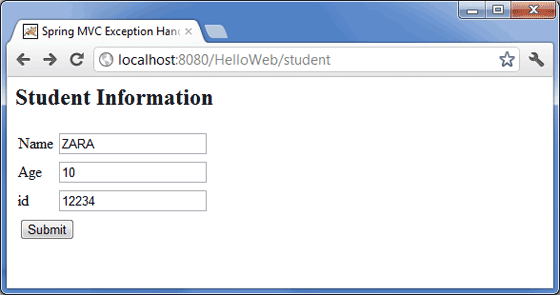
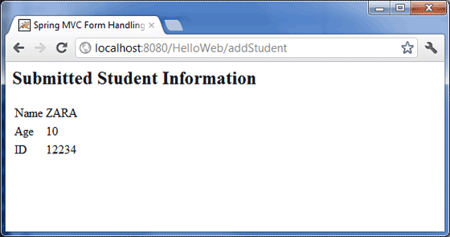

# Spring MVC 表单处理例子

下面的例子说明了如何编写一个简单的基于 web 的应用程序，它利用了使用 Spring 的 Web MVC 框架的 HTML 表单。为了开始使用它，让我们在恰当的位置使用 Eclipse IDE，然后按照下面的步骤使用 Spring 的 Web 框架来开发一个动态的基于表单的 Web 应用程序：
 
<table class="table table-bordered">
<tr><th class="fivepct">步骤</th><th>描述</th></tr>
<tr><td>1</td><td>创建一个名称为 <i>HelloWeb</i> 的<i>动态 Web 项目</i>，并且在已创建的项目的 <i>src</i> 文件夹中创建一个包 <i>com.tutorialspoint</i>。</td></tr>
<tr><td>2</td><td>将上面提到的 Spring 和其他库拖拽到文件夹 <i>WebContent/WEB-INF/lib</i> 中。</td></tr>
<tr><td>3</td><td>在 <i>com.tutorialspoint</i> 包下创建一个 Java 类 <i>Student</i> 和 <i>StudentController</i>。</td></tr>
<tr><td>4</td><td>在 <i>WebContent/WEB-INF</i> 文件夹下创建 Spring 的配置文件 <i>Web.xml</i> 和 <i>HelloWeb-servlet.xml</i>。</td></tr>
<tr><td>5</td><td>在 <i>WebContent/WEB-INF</i> 文件夹下创建名称为 <i>jsp</i> 的子文件夹。在这个子文件夹下创建视图文件 <i>student.jsp</i> 和 <i>result.jsp</i>。</td></tr>
<tr><td>6</td><td>最后一步是创建所有的源代码和配置文件的内容，并导出该应用程序，正如下面解释的一样。</td></tr>
</table>

这里是 **Student.java** 文件的内容：

```
package com.tutorialspoint;
public class Student {
   private Integer age;
   private String name;
   private Integer id;
   public void setAge(Integer age) {
      this.age = age;
   }
   public Integer getAge() {
      return age;
   }
   public void setName(String name) {
      this.name = name;
   }
   public String getName() {
      return name;
   }
   public void setId(Integer id) {
      this.id = id;
   }
   public Integer getId() {
      return id;
   }
}
```

下面是 **StudentController.java** 文件的内容：

```
package com.tutorialspoint;
import org.springframework.stereotype.Controller;
import org.springframework.web.bind.annotation.ModelAttribute;
import org.springframework.web.bind.annotation.RequestMapping;
import org.springframework.web.bind.annotation.RequestMethod;
import org.springframework.web.servlet.ModelAndView;
import org.springframework.ui.ModelMap;
@Controller
public class StudentController {
   @RequestMapping(value = "/student", method = RequestMethod.GET)
   public ModelAndView student() {
      return new ModelAndView("student", "command", new Student());
   }   
   @RequestMapping(value = "/addStudent", method = RequestMethod.POST)
   public String addStudent(@ModelAttribute("SpringWeb")Student student, 
   ModelMap model) {
      model.addAttribute("name", student.getName());
      model.addAttribute("age", student.getAge());
      model.addAttribute("id", student.getId());      
      return "result";
   }
}
```

在这里，第一个 service 方法 **student()**，我们已经在名称为 “command” 的 ModelAndView 对象中传递一个空的 **Student** 对象，因为 spring 框架需要一个名称的 “command” 的对象，如果你在 JSP 文件中使用 &lt;form:form&gt; 标签。所以，当 **student()** 方法被调用时，它返回 **student.jsp** 视图。

第二个 service 方法 **addStudent()** 将调用 **HelloWeb/addStudent** URL 中的 POST 方法。你将根据提交的信息准备好你的模型对象。最后一个 “result” 视图会从 service 方法中返回，它将导致呈现 result.jsp。

下面是 Spring Web 配置文件 **web.xml** 的内容

<pre class="prettyprint notranslate">
&lt;web-app id="WebApp_ID" version="2.4"
    xmlns="http://java.sun.com/xml/ns/j2ee" 
    xmlns:xsi="http://www.w3.org/2001/XMLSchema-instance"
    xsi:schemaLocation="http://java.sun.com/xml/ns/j2ee 
    http://java.sun.com/xml/ns/j2ee/web-app_2_4.xsd"&gt;
 
    &lt;display-name&gt;Spring MVC Form Handling&lt;/display-name&gt;
 
    &lt;servlet&gt;
        &lt;servlet-name&gt;HelloWeb&lt;/servlet-name&gt;
        &lt;servlet-class&gt;
           org.springframework.web.servlet.DispatcherServlet
        &lt;/servlet-class&gt;
        &lt;load-on-startup&gt;1&lt;/load-on-startup&gt;
    &lt;/servlet&gt;

    &lt;servlet-mapping&gt;
        &lt;servlet-name&gt;HelloWeb&lt;/servlet-name&gt;
        &lt;url-pattern&gt;/&lt;/url-pattern&gt;
    &lt;/servlet-mapping&gt;
 
&lt;/web-app&gt;
</pre>

下面是另一个 Spring Web 配置文件 **HelloWeb-servlet.xml** 的内容

<pre class="prettyprint notranslate">
&lt;beans xmlns="http://www.springframework.org/schema/beans"
   xmlns:context="http://www.springframework.org/schema/context"
   xmlns:xsi="http://www.w3.org/2001/XMLSchema-instance"
   xsi:schemaLocation="
   http://www.springframework.org/schema/beans     
   http://www.springframework.org/schema/beans/spring-beans-3.0.xsd
   http://www.springframework.org/schema/context 
   http://www.springframework.org/schema/context/spring-context-3.0.xsd"&gt;

   &lt;context:component-scan base-package="com.tutorialspoint" /&gt;

   &lt;bean class="org.springframework.web.servlet.view.InternalResourceViewResolver"&gt;
      &lt;property name="prefix" value="/WEB-INF/jsp/" /&gt;
      &lt;property name="suffix" value=".jsp" /&gt;
   &lt;/bean&gt;
 
&lt;/beans&gt;
</pre>

下面是 Spring 视图文件 **student.jsp** 的内容

<pre class="prettyprint notranslate">
&lt;%@taglib uri="http://www.springframework.org/tags/form" prefix="form"%&gt;
&lt;html&gt;
&lt;head&gt;
    &lt;title&gt;Spring MVC Form Handling&lt;/title&gt;
&lt;/head&gt;
&lt;body&gt;

&lt;h2&gt;Student Information&lt;/h2&gt;
&lt;form:form method="POST" action="/HelloWeb/addStudent"&gt;
   &lt;table&gt;
    &lt;tr&gt;
        &lt;td&gt;&lt;form:label path="name"&gt;Name&lt;/form:label&gt;&lt;/td&gt;
        &lt;td&gt;&lt;form:input path="name" /&gt;&lt;/td&gt;
    &lt;/tr&gt;
    &lt;tr&gt;
        &lt;td&gt;&lt;form:label path="age"&gt;Age&lt;/form:label&gt;&lt;/td&gt;
        &lt;td&gt;&lt;form:input path="age" /&gt;&lt;/td&gt;
    &lt;/tr&gt;
    &lt;tr&gt;
        &lt;td&gt;&lt;form:label path="id"&gt;id&lt;/form:label&gt;&lt;/td&gt;
        &lt;td&gt;&lt;form:input path="id" /&gt;&lt;/td&gt;
    &lt;/tr&gt;
    &lt;tr&gt;
        &lt;td colspan="2"&gt;
            &lt;input type="submit" value="Submit"/&gt;
        &lt;/td&gt;
    &lt;/tr&gt;
&lt;/table&gt;  
&lt;/form:form&gt;
&lt;/body&gt;
&lt;/html&gt;
</pre>

下面是 Spring 视图文件 **result.jsp** 的内容

<pre class="prettyprint notranslate">
&lt;%@taglib uri="http://www.springframework.org/tags/form" prefix="form"%&gt;
&lt;html&gt;
&lt;head&gt;
    &lt;title&gt;Spring MVC Form Handling&lt;/title&gt;
&lt;/head&gt;
&lt;body&gt;

&lt;h2&gt;Submitted Student Information&lt;/h2&gt;
   &lt;table&gt;
    &lt;tr&gt;
        &lt;td&gt;Name&lt;/td&gt;
        &lt;td&gt;${name}&lt;/td&gt;
    &lt;/tr&gt;
    &lt;tr&gt;
        &lt;td&gt;Age&lt;/td&gt;
        &lt;td&gt;${age}&lt;/td&gt;
    &lt;/tr&gt;
    &lt;tr&gt;
        &lt;td&gt;ID&lt;/td&gt;
        &lt;td&gt;${id}&lt;/td&gt;
    &lt;/tr&gt;
&lt;/table&gt;  
&lt;/body&gt;
&lt;/html&gt;
</pre>

最后，下面是包含在你的 web 应用程序中的 Spring 和其他库的列表。你仅仅需要将这些文件拖拽到 **WebContent/WEB-INF/lib** 文件夹中。

- commons-logging-x.y.z.jar

- org.springframework.asm-x.y.z.jar

- org.springframework.beans-x.y.z.jar

- org.springframework.context-x.y.z.jar

- org.springframework.core-x.y.z.jar

- org.springframework.expression-x.y.z.jar

- org.springframework.web.servlet-x.y.z.jar

- org.springframework.web-x.y.z.jar

- spring-web.jar

一旦你完成了创建源代码和配置文件后，导出你的应用程序。右键单击你的应用程序，并且使用 **Export > WAR File** 选项，并且在 Tomcat 的 *webapps* 文件夹中保存你的 **HelloWeb.war** 文件。

现在启动你的 Tomcat 服务器，并且确保你能够使用标准的浏览器访问 webapps 文件夹中的其他 web 页面。现在尝试访问该 URL **http://localhost:8080/SpringWeb/student**。如果你的 Spring Web 应用程序一切都正常，你应该看到下面的结果：



在提交必需的信息之后，单击提交按钮来提交这个表单。如果你的 Spring Web 应用程序一切都正常，你应该看到下面的结果：

