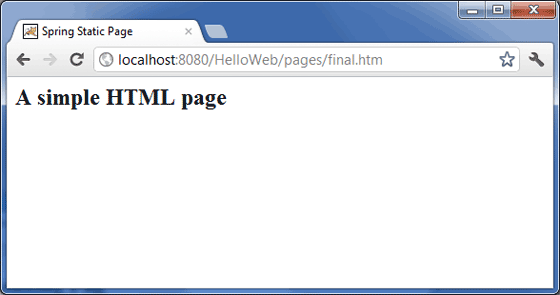

# Spring 静态页面例子

下面的例子说明了如何使用 Spring MVC 框架来编写一个简单的基于 web 的应用程序，它可以在 &lt;mvc:resources&gt; 标签的帮助下访问静态页面和动态页面。为了开始使用它，让我们在恰当的位置使用 Eclipse IDE，然后按照下面的步骤使用 Spring 的 Web 框架来开发一个动态的基于表单的 Web 应用程序：
 
<table class="table table-bordered">
<tr><th class="fivepct">步骤</th><th>描述</th></tr>
<tr><td>1</td><td>创建一个名称为 <i>HelloWeb</i> 的<i>动态 Web 项目</i>，并且在已创建的项目的 <i>src</i> 文件夹中创建一个包 <i>com.tutorialspoint</i>。</td></tr>
<tr><td>2</td><td>将上面提到的 Spring 和其他库拖拽到文件夹 <i>WebContent/WEB-INF/lib</i> 中。</td></tr>
<tr><td>3</td><td>在 <i>com.tutorialspoint</i> 包下创建一个 Java 类 <i>WebController</i>。</td></tr>
<tr><td>4</td><td>在 <i>WebContent/WEB-INF</i> 文件夹下创建 Spring 的配置文件 <i>Web.xml</i> 和 <i>HelloWeb-servlet.xml</i>。</td></tr>
<tr><td>5</td><td>在 <i>WebContent/WEB-INF</i> 文件夹下创建名称为 <i>jsp</i> 的子文件夹。在这个子文件夹下创建一个视图文件 <i>index.jsp</i>。</td></tr>
<tr><td>6</td><td>在 <i>WebContent/WEB-INF</i> 文件夹下创建名称为 <i>pages</i> 的子文件夹。在这个子文件夹下创建一个静态文件 <i>final.htm</i></td></tr>
<tr><td>7</td><td>最后一步是创建所有的源代码和配置文件的内容，并导出该应用程序，正如下面解释的一样。</td></tr>
</table>

这里是 **WebController.java** 文件的内容：

```
package com.tutorialspoint;
import org.springframework.stereotype.Controller;
import org.springframework.web.bind.annotation.RequestMapping;
import org.springframework.web.bind.annotation.RequestMethod;
@Controller
public class WebController {
   @RequestMapping(value = "/index", method = RequestMethod.GET)
   public String index() {
	   return "index";
   }   
   @RequestMapping(value = "/staticPage", method = RequestMethod.GET)
   public String redirect() {     
      return "redirect:/pages/final.htm";
   }
}
```

下面是 Spring Web 配置文件 **web.xml** 的内容

<pre class="prettyprint notranslate">
&lt;web-app id="WebApp_ID" version="2.4"
    xmlns="http://java.sun.com/xml/ns/j2ee" 
    xmlns:xsi="http://www.w3.org/2001/XMLSchema-instance"
    xsi:schemaLocation="http://java.sun.com/xml/ns/j2ee 
    http://java.sun.com/xml/ns/j2ee/web-app_2_4.xsd"&gt;
 
    &lt;display-name&gt;Spring Page Redirection&lt;/display-name&gt;
 
    &lt;servlet&gt;
        &lt;servlet-name&gt;HelloWeb&lt;/servlet-name&gt;
        &lt;servlet-class&gt;
           org.springframework.web.servlet.DispatcherServlet
        &lt;/servlet-class&gt;
        &lt;load-on-startup&gt;1&lt;/load-on-startup&gt;
    &lt;/servlet&gt;
   
    &lt;servlet-mapping&gt;
        &lt;servlet-name&gt;HelloWeb&lt;/servlet-name&gt;
        &lt;url-pattern&gt;/&lt;/url-pattern&gt;
    &lt;/servlet-mapping&gt;
  
&lt;/web-app&gt;
</pre>

下面是另一个 Spring Web 配置文件 **HelloWeb-servlet.xml** 的内容

<pre class="prettyprint notranslate">
&lt;?xml version="1.0" encoding="UTF-8"?&gt;
&lt;beans xmlns="http://www.springframework.org/schema/beans"
 xmlns:xsi="http://www.w3.org/2001/XMLSchema-instance" 
 xmlns:context="http://www.springframework.org/schema/context"
 xmlns:mvc="http://www.springframework.org/schema/mvc"
 xsi:schemaLocation="http://www.springframework.org/schema/beans
 http://www.springframework.org/schema/beans/spring-beans-2.5.xsd
 http://www.springframework.org/schema/mvc
 http://www.springframework.org/schema/mvc/spring-mvc-3.0.xsd
 http://www.springframework.org/schema/context
 http://www.springframework.org/schema/context/spring-context-3.0.xsd"&gt;
 
    &lt;context:component-scan base-package="com.tutorialspoint" /&gt;
     
    &lt;bean id="viewResolver" class="org.springframework.web.servlet.view.InternalResourceViewResolver"&gt;
    &lt;property name="prefix" value="/WEB-INF/jsp/" /&gt;
    &lt;property name="suffix" value=".jsp" /&gt;
    &lt;/bean&gt;
    
    &lt;mvc:resources mapping="/pages/**" location="/WEB-INF/pages/" /&gt;
    &lt;mvc:annotation-driven/&gt;
    
&lt;/beans&gt;
</pre>

在这里，**&lt;mvc:resources..../&gt;** 标签被用来映射静态页面。 **mapping** 属性必须是一个指定一个 http 请求的 URL 模式的 Ant 模式。 **location** 属性必须指定一个或者多个具有包含图片，样式表，JavaScript 和其他静态内容的静态页面的资源目录位置。多个资源位置可以使用逗号分隔这些值的列表来被指定。

下面是 Spring 视图文件 **WEB-INF/jsp/index.jsp** 的内容。这将是一个登陆页面，这个页面将发送一个请求来访问 **staticPage** 的 service 方法，它将重定向这个请求到 WEB-INF/pages 文件夹中的一个可用的静态页面。

<pre class="prettyprint notranslate">
&lt;%@taglib uri="http://www.springframework.org/tags/form" prefix="form"%&gt;
&lt;html&gt;
&lt;head&gt;
    &lt;title&gt;Spring Landing Page&lt;/title&gt;
&lt;/head&gt;
&lt;body&gt;
&lt;h2&gt;Spring Landing Pag&lt;/h2&gt;
&lt;p&gt;Click below button to get a simple HTML page&lt;/p&gt;
&lt;form:form method="GET" action="/HelloWeb/staticPage"&gt;
&lt;table&gt;
    &lt;tr&gt;
    &lt;td&gt;
    &lt;input type="submit" value="Get HTML Page"/&gt;
    &lt;/td&gt;
    &lt;/tr&gt;
&lt;/table&gt;  
&lt;/form:form&gt;
&lt;/body&gt;
&lt;/html&gt;
</pre>

下面是 Spring 视图文件 **WEB-INF/pages/final.htm** 的内容。

<pre class="prettyprint notranslate">
&lt;html&gt;
&lt;head&gt;
    &lt;title&gt;Spring Static Page&lt;/title&gt;
&lt;/head&gt;
&lt;body&gt;

&lt;h2&gt;A simple HTML page&lt;/h2&gt;

&lt;/body&gt;
&lt;/html&gt;
</pre>

最后，下面是包含在你的 web 应用程序中的 Spring 和其他库的列表。你仅仅需要将这些文件拖拽到 **WebContent/WEB-INF/lib** 文件夹中。

- commons-logging-x.y.z.jar

- org.springframework.asm-x.y.z.jar

- org.springframework.beans-x.y.z.jar

- org.springframework.context-x.y.z.jar

- org.springframework.core-x.y.z.jar

- org.springframework.expression-x.y.z.jar

- org.springframework.web.servlet-x.y.z.jar

- org.springframework.web-x.y.z.jar

- spring-web.jar

一旦你完成了创建源代码和配置文件后，导出你的应用程序。右键单击你的应用程序，并且使用 **Export > WAR File** 选项，并且在 Tomcat 的 *webapps* 文件夹中保存你的 **HelloWeb.war** 文件。

现在启动你的 Tomcat 服务器，并且确保你能够使用标准的浏览器访问 webapps 文件夹中的其他 web 页面。现在尝试访问该 URL **http://localhost:8080/HelloWeb/index**。 如果你的 Spring Web 应用程序一切都正常，你应该看到下面的结果：


单击 “Get HTML Page” 按钮来访问 staticPage 中的 service 方法中提到的一个静态页面。如果你的 Spring Web 应用程序一切都正常，你应该看到下面的结果：


